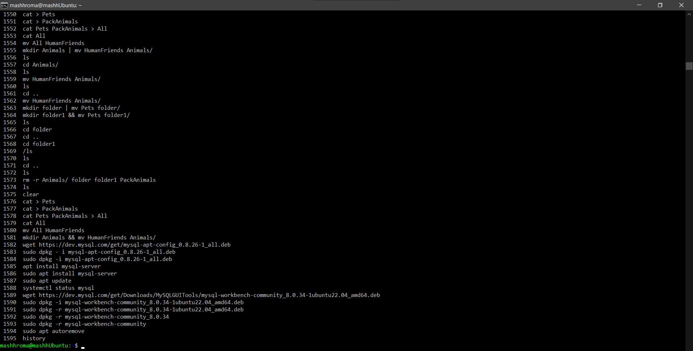
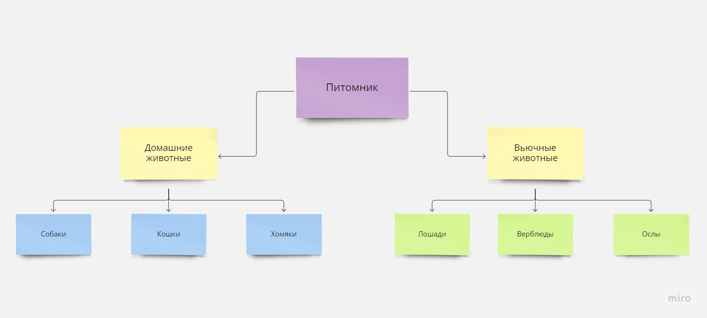
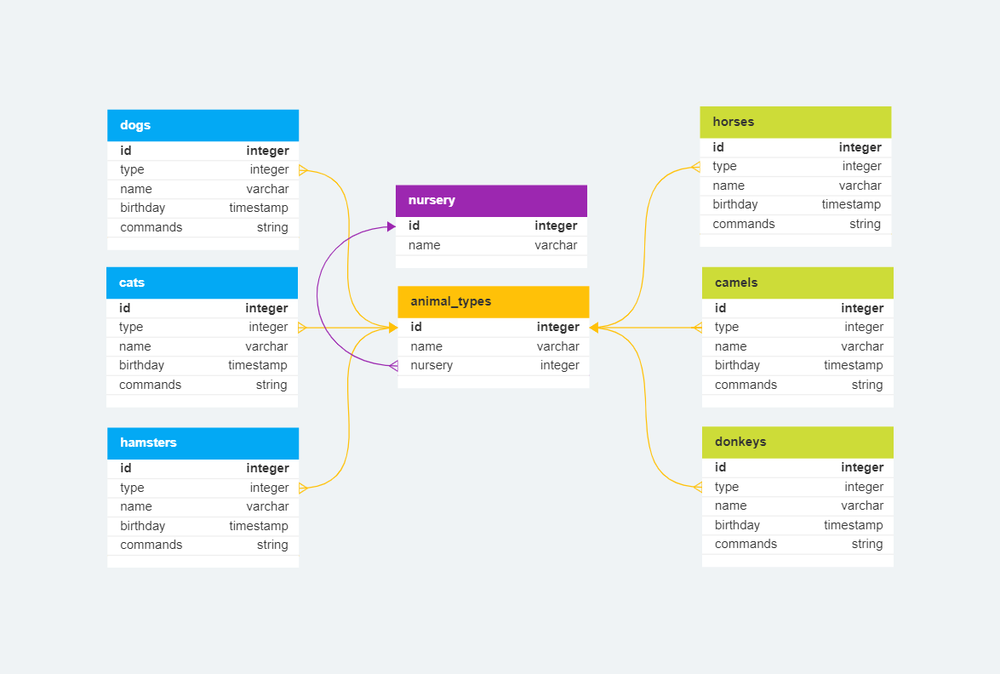

# Итоговая контрольная работа по блоку специализация "Программист"

## Информация о проекте

Организация системы учета для питомника, в котором живут домашние и вьючные животные с помощью файловой системы Linux, базы данных SQL и программы на языке Java.

## Задание

1. Используя команду cat в терминале операционной системы Linux, создать два файла Домашние животные (заполнив файл собаками, кошками, хомяками) и Вьючные животными (заполнив файл Лошадьми, верблюдами и ослы), а затем объединить их.  
Просмотреть содержимое созданного файла.  
Переименовать файл, дав ему новое имя (Друзья человека).

    ```bash
    cat > Pets
    Dogs
    Cats
    Hamsters

    cat > PackAnimals
    Horses
    Camels
    Donkeys

    cat Pets PackAnimals > All
    cat All
    mv All HumanFriends
    ```

2. Создать директорию, переместить файл туда.

    ```bash
    mkdir Animals && mv HumanFriends Animals/
    ```

3. Подключить дополнительный репозиторий MySQL. Установить любой пакет из этого репозитория.

    ```bash
    wget https://dev.mysql.com/get/mysql-apt-config_0.8.26-1_all.deb
    sudo dpkg -i mysql-apt-config_0.8.26-1_all.deb
    sudo apt install mysql-server
    sudo apt update
    systemctl status mysql
    ```

4. Установить и удалить deb-пакет с помощью dpkg.

    ```bash
    wget https://dev.mysql.com/get/Downloads/MySQLGUITools/mysql-workbench-community_8.0.34-1ubuntu22.04_amd64.deb 
    sudo dpkg -i mysql-workbench-community_8.0.34-1ubuntu22.04_amd64.deb
    sudo dpkg -r mysql-workbench-community
    sudo apt autoremove
    ```

5. Выложить историю команд в терминале ubuntu.
    

6. Нарисовать диаграмму, в которой есть родительский класс, домашние животные и вьючные животные, в составы которых в случае домашних животных войдут классы: собаки, кошки, хомяки, а в класс вьючные животные войдут: лошади, верблюды и ослы.
    
    

7. В подключенном MySQL репозитории создать базу данных “Друзья человека”.

    ```sql
    CREATE DATABASE human_friends;
    ```

8. Создать таблицы с иерархией из диаграммы в БД.  
    [SQL-скрипт создания таблиц](./sql_scripts/create_tables.sql "SQL-script")

9. Заполнить низкоуровневые таблицы именами(животных), командами которые они выполняют и датами рождения.  
    [SQL-скрипт заполнения таблиц](./sql_scripts/insert_tables.sql "SQL-script")

10. Удалить из таблицы верблюдов, т.к. верблюдов решили перевезти в другой питомник на зимовку. Объединить таблицы лошади, и ослы в одну таблицу.  [SQL-скрипт](./sql_scripts/change_tables.sql "SQL-script")

    ```sql
    DROP TABLE camels;

    CREATE TABLE horses_donkeys
        SELECT type, name, birthday, commands
        FROM horses
        UNION
        SELECT type, name, birthday, commands
        FROM donkeys;

    ALTER TABLE horses_donkeys
    ADD COLUMN
        id SERIAL PRIMARY KEY;
        
    DROP TABLE horses, donkeys; 
    ```

11. Создать новую таблицу “молодые животные” в которую попадут все животные старше 1 года, но младше 3 лет и в отдельном столбце с точностью до месяца подсчитать возраст животных в новой таблице.

12. Объединить все таблицы в одну, при этом сохраняя поля, указывающие на прошлую принадлежность к старым таблицам.

13. Создать класс с Инкапсуляцией методов и наследованием по диаграмме.

14. Написать программу, имитирующую работу реестра домашних животных. В программе должен быть реализован следующий функционал:
    1. Завести новое животное
    2. определять животное в правильный класс
    3. увидеть список команд, которое выполняет животное
    4. обучить животное новым командам
    5. Реализовать навигацию по меню

15. Создайте класс Счетчик, у которого есть метод add(), увеличивающий̆ значение внутренней̆int переменной̆на 1 при нажатие “Завести новое животное” Сделайте так, чтобы с объектом такого типа можно было работать в блоке try-with-resources. Нужно бросить исключение, если работа с объектом типа счетчик была не в ресурсном try и/или ресурс остался открыт. Значение считать в ресурсе try, если при заведения животного заполнены все поля.
